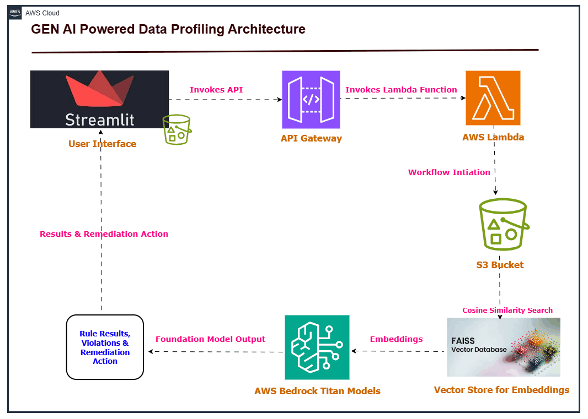

# Automated Regulatory Data Profiling Solution

An AI-powered solution for automating regulatory compliance data profiling in banking using AWS services and Generative AI.

## 🚀 Project Overview

**GenAI Data Profiler (GenAI_DP)** is a serverless application that:
- Automates generation of data profiling rules from regulatory documents
- Identifies compliance violations in transaction data
- Generates AI-powered remediation actions
- Provides interactive visualization of compliance results

## 🔍 Key Features
- **AI-Powered Rule Generation** - Leverages AWS Bedrock Titan models
- **Serverless Architecture** - Built with AWS Lambda and API Gateway
- **Compliance Visualization** - Streamlit-powered UI for results analysis
- **Cost-Effective Storage** - FAISS vector database for embeddings
- **Regulatory Document Analysis** - PDF/CSV processing with LangChain

## 🛠️ Architecture

## 📦 Prerequisites
- Python 3.9+
- AWS CLI configured with proper permissions
- AWS Bedrock access enabled
- Required Python packages:
pandas==2.0.3
boto3==1.34.97
streamlit==1.36.0
langchain==0.2.1
faiss-cpu==1.7.4

## 🚀 Installation
1. Clone repository:
git clone https://github.com/anirudhyadavds/gaidp-ai-detectives.git
cd Hackathon/GenAI_DP

2. Install dependencies:

pip install -r requirements.txt

3. Configure AWS credentials:
aws configure

## ⚙️ Configuration
Set environment variables in `.env`:
AWS_REGION=us-east-1
S3_BUCKET=your-bucket-name
BEDROCK_MODEL_ID=amazon.titan-text-premier-v1:0
EMBEDDING_MODEL_ID=amazon.titan-embed-text-v2:0

## 🧠 Implementation Details

### Key Components
| Component               | Technology Stack       |
|-------------------------|------------------------|
| Frontend                | Streamlit              |
| API Layer               | AWS API Gateway        |
| Processing Engine       | AWS Lambda             |
| Document Storage        | Amazon S3              |
| AI Models               | AWS Bedrock (Titan)    |
| Vector Database         | FAISS                  |

### Data Flow
1. User uploads CSV files via Streamlit UI
2. Files stored in S3 bucket
3. API Gateway triggers Lambda function
4. Lambda processes data using Bedrock models
5. Results stored in S3 and displayed in UI

## 🚨 Usage
1. Start Streamlit UI:

2. API Endpoints:
POST /profile - Process regulatory documents

Example API Request:

curl -X POST https://<api-id>.execute-api.<region>.amazonaws.com/prod/profile
-H "x-api-key: YOUR_API_KEY"
-H "Content-Type: application/json"
-d '{
"instructions_file": "regulations.csv",
"transaction_file": "transactions.csv"
}'

## 📄 License
This project is licensed under the MIT License - see the [LICENSE](LICENSE) file for details.

## 🤝 Contributing
1. Fork the project
2. Create your feature branch (`git checkout -b feature/AmazingFeature`)
3. Commit your changes (`git commit -m 'Add some AmazingFeature'`)
4. Push to the branch (`git push origin feature/AmazingFeature`)
5. Open a Pull Request

## 📚 Resources
- [AWS Bedrock Documentation](https://docs.aws.amazon.com/bedrock/)
- [Streamlit Documentation](https://docs.streamlit.io/)
- [FAISS Documentation](https://github.com/facebookresearch/faiss)

---

**Note**: Requires AWS Bedrock access and proper IAM permissions for S3/Lambda/Bedrock services.

